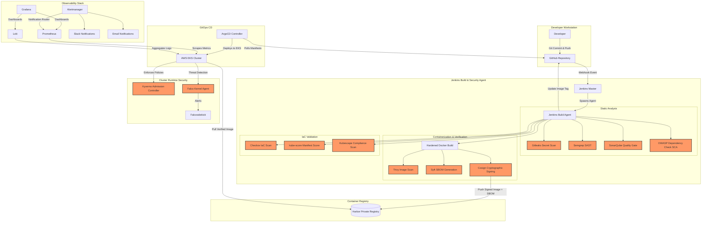
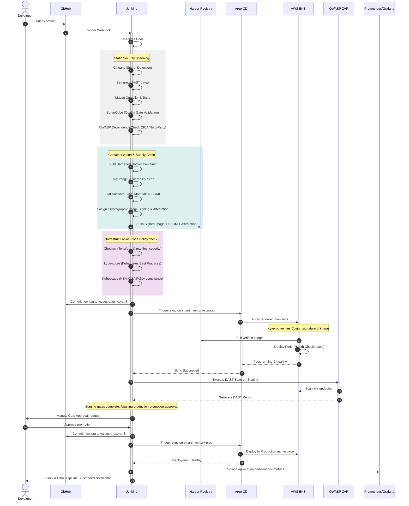

# Enterprise DevSecOps Platform Architecture & Integration Guide

This document outlines the architectural blueprints, pipeline workflows, security integrations, and runtime configurations for the **SmartInventory DevSecOps Platform**.

---

## 1. Project Architecture

The platform follows a **"Shift-Left" DevSecOps methodology** and a **Zero-Trust infrastructure model**. Standard security checks are integrated at every stage of the lifecycle, from code commit to cluster runtime monitoring.

### Component Diagram

---

## 2. Pipeline Flow Sequence

The diagram below details the execution sequence from the initial code commit to the successful verification in production.

---

## 3. Tool Integration & Security Gates

| Tool | Phase | Scope | Exit/Failure Criteria | Action on Failure |
| :--- | :--- | :--- | :--- | :--- |
| **Gitleaks** | Pre-Build | Scans code commit history for hardcoded secrets, private keys, and config credentials. | Any secret detected. | Fails build immediately; publishes report. |
| **Semgrep** | Pre-Build | Static analysis of Java code for OWASP Top 10 flaws (SQLi, XSS, Path Traversal). | Any severity `ERROR` or critical vulnerabilities found. | Fails build; logs code lines containing flaws. |
| **SonarQube** | Compilation | Code quality and structural security metrics validation. | Wait for quality gate status != `OK`. | Fails build; restricts packaging. |
| **OWASP Dependency Check** | Build/SCA | Scans third-party libraries (`pom.xml` dependencies) for known CVEs. | Any vulnerability with a CVSS score >= `7.0` (High/Critical). | Fails build; publishes Dependency Check HTML report. |
| **Trivy** | Post-Build | OS-level package vulnerability scanning inside the compiled Docker image. | Any `CRITICAL` severity vulnerability. | Fails build; halts image registry push. |
| **Syft** | Post-Build | Generates complete Software Bill of Materials (SBOM) in CycloneDX JSON format. | Missing files or output write errors. | Halts signing process. |
| **Cosign** | Pre-Push | Generates a cryptographic signature and attaches the SBOM attestation. | Private key decryption failure. | Fails pipeline. |
| **Checkov** | IaC Scan | Scans Terraform config and Kubernetes templates for infrastructure misconfigurations. | Any `HIGH` or `CRITICAL` violations of CIS Benchmarks. | Fails pipeline; blocks deployment stages. |
| **kube-score** | IaC Scan | Checks generated Kubernetes manifests against best practice defaults (probes, run-as-user). | Manifest syntax errors or critical policy failures. | Generates warning report for remediation. |
| **Kubescape** | IaC Scan | Checks manifest templates against NSA-CISA and MITRE ATT&CK security controls. | Compliance score falls below threshold. | Logs warning report. |
| **Kyverno** | Admission | Validates, mutates, and verifies image signatures at cluster runtime admission. | Unsigned image or image from unapproved registry. | Blocks Pod creation; generates audit event. |
| **OWASP ZAP** | Staging DAST | Scans Staging web application endpoint via active/passive security exploits. | Any `HIGH` or `CRITICAL` alert found. | Fails pipeline; blocks Production promotion. |
| **Falco** | Production Run | Performs system call inspection on nodes for malicious indicators (shell spawns, write to `/etc`). | Rule triggers critical notification. | Alerts forwarded to Alertmanager → Slack/Email. |

---

## 4. Troubleshooting Guide

### Issue: Trivy Scan fails during pipeline execution
- **Cause**: Trivy cannot download its database due to network isolation or GitHub API rate limits.
- **Solution**: Configure a local mirror for the Trivy DB or configure caching of the DB under `/tmp/trivy-cache` as specified in `security/trivy/trivy.yaml`.

### Issue: Kyverno blocks image deployment with "Image failed signature verification"
- **Cause**: Image was either not signed by Cosign in the pipeline, or the public key mounted in Kyverno cluster policy does not match the private key used to sign.
- **Solution**:
  1. Ensure the Cosign stage in the `Jenkinsfile` executed successfully.
  2. Verify signature manually: `cosign verify --key cosign.pub <image-uri>`.
  3. Verify the public key string matches the one configured in `kyverno/policies.yaml`.

### Issue: ArgoCD Out-of-Sync due to manual kubectl edits
- **Cause**: Manual edits in the cluster drift from Git config.
- **Solution**: ArgoCD has self-heal enabled which should automatically override manual edits. If it remains stuck, check the sync status under the ArgoCD dashboard or execute `argocd app rollback <app-name>` or re-trigger sync with `--prune`.

### Issue: SonarQube quality gate timeout
- **Cause**: SonarQube background processing takes longer than the timeout threshold.
- **Solution**: Increase the timeout parameter in the `Jenkinsfile` `waitForQualityGate()` step, or check the SonarQube server load status.
